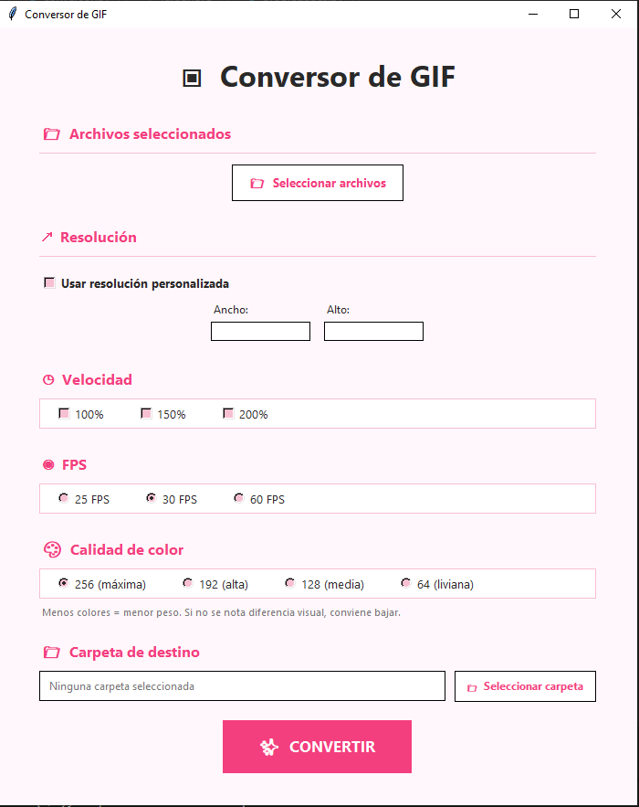

# Conversor GIF

Aplicación de escritorio desarrollada en Python para convertir archivos `.mov` a `.gif`.

## Características

- Conversión de múltiples archivos simultáneamente.
- Cambio de resolución.
- Resoluciones predefinidas y personalizadas.
- Cambio de velocidad de reproducción.
- Selección de FPS.
- Configuración de calidad de color.
- Selección de carpeta de destino.
- Barra de progreso durante la conversión.
- Evita sobrescribir archivos existentes.

## Tecnologías

- Python
- Tkinter
- FFmpeg
- imageio-ffmpeg
